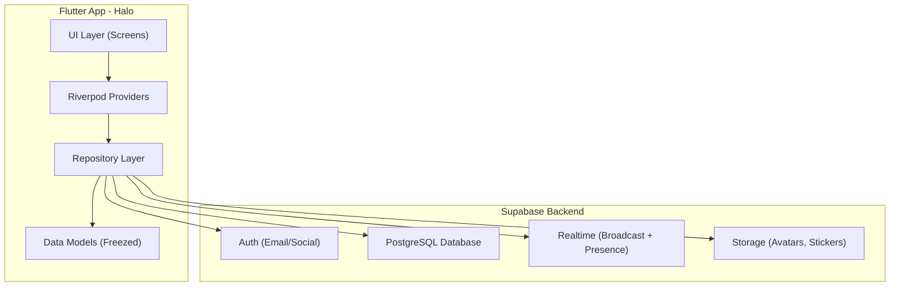

# Halo - Social Location Sharing App

Xây dựng ứng dụng mobile Flutter tương tự **Jagat** với tên gọi **Halo**, sử dụng **Riverpod v3** (code generation), **GoRouter**, và **Supabase** làm backend.

## User Review Required

> [!IMPORTANT]
> **Supabase Credentials**: Bạn cần tạo project trên [supabase.com](https://supabase.com) và cung cấp `SUPABASE_URL` + `SUPABASE_ANON_KEY` để app hoạt động. Tôi sẽ tạo placeholder để bạn điền sau.

> [!IMPORTANT]
> **Google Maps API Key**: Cần API key cho Google Maps SDK (Android & iOS). Bạn có muốn dùng Google Maps hay **OpenStreetMap (flutter_map)** miễn phí? Mặc định tôi sẽ dùng **flutter_map + OpenStreetMap** để không cần API key.

> [!WARNING]
> **Platform**: Project sẽ được tạo cho **Android + iOS**. Bạn có cần hỗ trợ platform nào khác không?

---

## Tổng Quan Kiến Trúc



### Tech Stack

| Layer | Technology |
|-------|------------|
| Framework | Flutter 3.x |
| State Management | Riverpod v3 (3.3.x) + `riverpod_generator` |
| Navigation | GoRouter |
| Backend | Supabase (Auth, Database, Realtime, Storage) |
| Maps | `flutter_map` + OpenStreetMap (miễn phí, không cần API key) |
| Location | `geolocator` + `geocoding` |
| Models | `freezed` + `json_serializable` |
| Local Storage | `shared_preferences` |

---

## Supabase Database Schema

```sql
-- Profiles table (extends auth.users)
CREATE TABLE profiles (
    id UUID PRIMARY KEY REFERENCES auth.users(id) ON DELETE CASCADE,
    username TEXT UNIQUE NOT NULL,
    display_name TEXT,
    avatar_url TEXT,
    bio TEXT,
    status_emoji TEXT DEFAULT '😊',
    status_text TEXT DEFAULT '',
    latitude DOUBLE PRECISION,
    longitude DOUBLE PRECISION,
    location_updated_at TIMESTAMPTZ,
    is_online BOOLEAN DEFAULT FALSE,
    last_seen TIMESTAMPTZ DEFAULT NOW(),
    created_at TIMESTAMPTZ DEFAULT NOW(),
    updated_at TIMESTAMPTZ DEFAULT NOW()
);

-- Friendships
CREATE TABLE friendships (
    id UUID PRIMARY KEY DEFAULT gen_random_uuid(),
    user_id UUID REFERENCES profiles(id) ON DELETE CASCADE,
    friend_id UUID REFERENCES profiles(id) ON DELETE CASCADE,
    status TEXT DEFAULT 'pending' CHECK (status IN ('pending', 'accepted', 'blocked')),
    created_at TIMESTAMPTZ DEFAULT NOW(),
    UNIQUE(user_id, friend_id)
);

-- Chat rooms
CREATE TABLE chat_rooms (
    id UUID PRIMARY KEY DEFAULT gen_random_uuid(),
    name TEXT,
    is_group BOOLEAN DEFAULT FALSE,
    created_by UUID REFERENCES profiles(id),
    created_at TIMESTAMPTZ DEFAULT NOW()
);

-- Chat room members
CREATE TABLE chat_room_members (
    id UUID PRIMARY KEY DEFAULT gen_random_uuid(),
    room_id UUID REFERENCES chat_rooms(id) ON DELETE CASCADE,
    user_id UUID REFERENCES profiles(id) ON DELETE CASCADE,
    joined_at TIMESTAMPTZ DEFAULT NOW(),
    UNIQUE(room_id, user_id)
);

-- Messages
CREATE TABLE messages (
    id UUID PRIMARY KEY DEFAULT gen_random_uuid(),
    room_id UUID REFERENCES chat_rooms(id) ON DELETE CASCADE,
    sender_id UUID REFERENCES profiles(id) ON DELETE CASCADE,
    content TEXT,
    message_type TEXT DEFAULT 'text' CHECK (message_type IN ('text', 'sticker', 'image', 'location')),
    sticker_url TEXT,
    metadata JSONB DEFAULT '{}',
    created_at TIMESTAMPTZ DEFAULT NOW()
);

-- Sticker packs
CREATE TABLE sticker_packs (
    id UUID PRIMARY KEY DEFAULT gen_random_uuid(),
    name TEXT NOT NULL,
    thumbnail_url TEXT,
    created_at TIMESTAMPTZ DEFAULT NOW()
);

-- Stickers
CREATE TABLE stickers (
    id UUID PRIMARY KEY DEFAULT gen_random_uuid(),
    pack_id UUID REFERENCES sticker_packs(id) ON DELETE CASCADE,
    name TEXT,
    image_url TEXT NOT NULL,
    created_at TIMESTAMPTZ DEFAULT NOW()
);
```

---

## Proposed Changes

### 1. Project Setup & Configuration

#### [NEW] Flutter project initialization
- Chạy `flutter create` với package name `com.halo.app`
- Cấu trúc thư mục theo Clean Architecture

#### [NEW] `pubspec.yaml`
Dependencies chính:
```yaml
dependencies:
  flutter_riverpod: ^3.3.1
  riverpod_annotation: ^3.3.1
  go_router: ^14.x
  supabase_flutter: ^2.5.x
  flutter_map: ^7.x
  latlong2: ^0.9.x
  geolocator: ^12.x
  geocoding: ^3.x
  freezed_annotation: ^2.x
  json_annotation: ^4.x
  shared_preferences: ^2.x
  cached_network_image: ^3.x
  image_picker: ^1.x
  intl: ^0.19.x
  uuid: ^4.x
  timeago: ^3.x

dev_dependencies:
  riverpod_generator: ^3.3.x
  build_runner: ^2.x
  freezed: ^2.x
  json_serializable: ^6.x
  riverpod_lint: ^3.x
  flutter_lints: ^5.x
```

---

### 2. Cấu Trúc Thư Mục

```
lib/
├── main.dart
├── app.dart
├── core/
│   ├── constants/
│   │   ├── app_colors.dart
│   │   ├── app_text_styles.dart
│   │   ├── app_sizes.dart
│   │   └── supabase_constants.dart
│   ├── theme/
│   │   └── app_theme.dart
│   ├── router/
│   │   └── app_router.dart
│   ├── utils/
│   │   ├── extensions.dart
│   │   └── helpers.dart
│   └── widgets/
│       ├── halo_button.dart
│       ├── halo_text_field.dart
│       ├── halo_avatar.dart
│       └── loading_overlay.dart
├── features/
│   ├── auth/
│   │   ├── data/
│   │   │   └── auth_repository.dart
│   │   ├── domain/
│   │   │   └── user_model.dart
│   │   ├── presentation/
│   │   │   ├── screens/
│   │   │   │   ├── login_screen.dart
│   │   │   │   ├── register_screen.dart
│   │   │   │   └── splash_screen.dart
│   │   │   └── providers/
│   │   │       └── auth_provider.dart
│   │   └── widgets/
│   ├── map/
│   │   ├── data/
│   │   │   └── location_repository.dart
│   │   ├── presentation/
│   │   │   ├── screens/
│   │   │   │   └── map_screen.dart
│   │   │   └── providers/
│   │   │       ├── location_provider.dart
│   │   │       └── map_provider.dart
│   │   └── widgets/
│   │       ├── friend_marker.dart
│   │       ├── map_controls.dart
│   │       └── friend_bottom_sheet.dart
│   ├── friends/
│   │   ├── data/
│   │   │   └── friends_repository.dart
│   │   ├── domain/
│   │   │   └── friendship_model.dart
│   │   ├── presentation/
│   │   │   ├── screens/
│   │   │   │   ├── friends_list_screen.dart
│   │   │   │   └── add_friend_screen.dart
│   │   │   └── providers/
│   │   │       └── friends_provider.dart
│   │   └── widgets/
│   │       └── friend_tile.dart
│   ├── chat/
│   │   ├── data/
│   │   │   └── chat_repository.dart
│   │   ├── domain/
│   │   │   ├── message_model.dart
│   │   │   └── chat_room_model.dart
│   │   ├── presentation/
│   │   │   ├── screens/
│   │   │   │   ├── chat_list_screen.dart
│   │   │   │   └── chat_room_screen.dart
│   │   │   └── providers/
│   │   │       └── chat_provider.dart
│   │   └── widgets/
│   │       ├── message_bubble.dart
│   │       ├── sticker_picker.dart
│   │       └── chat_input.dart
│   ├── status/
│   │   ├── data/
│   │   │   └── status_repository.dart
│   │   ├── presentation/
│   │   │   ├── screens/
│   │   │   │   └── status_screen.dart
│   │   │   └── providers/
│   │   │       └── status_provider.dart
│   │   └── widgets/
│   │       └── status_card.dart
│   └── profile/
│       ├── data/
│       │   └── profile_repository.dart
│       ├── presentation/
│       │   ├── screens/
│       │   │   ├── profile_screen.dart
│       │   │   └── edit_profile_screen.dart
│       │   └── providers/
│       │       └── profile_provider.dart
│       └── widgets/
│           └── profile_header.dart
```

---

### 3. Core Components

#### [NEW] `lib/main.dart`
- Khởi tạo Supabase
- Wrap app trong `ProviderScope`

#### [NEW] `lib/app.dart`
- `ConsumerWidget` với `MaterialApp.router`
- Dark theme mặc định (tương tự Jagat)
- Sử dụng GoRouter từ provider

#### [NEW] `lib/core/router/app_router.dart`
- GoRouter provider với Riverpod
- Auth redirect logic
- Routes: splash, login, register, home (shell route với bottom nav gồm Map, Friends, Chat, Profile)

#### [NEW] `lib/core/theme/app_theme.dart`
- Dark theme chủ đạo
- Color scheme: xanh neon (#00E5FF) + tím (#7C4DFF) gradient
- Typography: Google Fonts (Inter)

---

### 4. Features Implementation

#### Auth Feature
- **Login**: Email/Password via Supabase Auth
- **Register**: Tạo account + profile
- **Splash**: Check session & auto-login
- **Provider**: `authProvider` quản lý auth state, auto-refresh token

#### Map Feature (Trang chính)
- **Map Screen**: Hiển thị bản đồ OpenStreetMap full-screen
- **Friend Markers**: Hiển thị avatar bạn bè trên bản đồ với vòng tròn màu
- **Location Sharing**: Gửi vị trí qua Supabase Realtime Broadcast (low latency)
- **Bottom Sheet**: Tap marker → hiện thông tin bạn bè (tên, khoảng cách, status)
- **My Location**: Nút center về vị trí của mình

#### Friends Feature
- **Friends List**: Danh sách bạn bè với status online/offline
- **Add Friend**: Tìm bạn qua username
- **Friend Requests**: Accept/Reject/Block
- **Provider**: Stream realtime danh sách bạn bè

#### Chat Feature
- **Chat List**: Danh sách conversations, sắp xếp theo tin nhắn mới nhất
- **Chat Room**: 
  - Nhắn tin text realtime (Supabase stream)
  - Gửi sticker (asset stickers tích hợp sẵn)
  - Gửi vị trí hiện tại
  - Typing indicator (Realtime Presence)
- **Sticker Picker**: Grid sticker packs, tap để gửi

#### Status Feature
- **Status Screen**: Hiển thị status emoji + text của bạn bè
- **Update Status**: Chọn emoji + nhập text ngắn
- **Realtime**: Cập nhật status realtime qua Supabase stream

#### Profile Feature
- **Profile Screen**: Avatar, tên, bio, thống kê
- **Edit Profile**: Đổi avatar (upload Supabase Storage), tên, bio
- **Settings**: Bật/tắt chia sẻ vị trí, đăng xuất

---

### 5. Supabase Realtime Strategy

| Feature | Method | Reason |
|---------|--------|--------|
| Location Tracking | **Broadcast** | High-frequency, không cần lưu mỗi update |
| Chat Messages | **Database Stream** | Cần persistent, lịch sử chat |
| Online Status | **Presence** | Tự động track join/leave |
| Typing Indicator | **Broadcast** | Ephemeral, không cần lưu DB |
| Friend Status | **Database Stream** | Cần persistent |

---

## Open Questions

> [!IMPORTANT]
> 1. **Maps**: Dùng **OpenStreetMap (miễn phí)** hay **Google Maps (cần API key)**? Mặc định: OpenStreetMap
> 2. **Stickers**: Dùng emoji/sticker tích hợp sẵn (asset) hay tải từ server? Mặc định: Asset tích hợp sẵn
> 3. **Auth method**: Chỉ Email/Password hay thêm Google/Apple Sign-in? Mặc định: Email/Password
> 4. **Tên app**: Giữ tên **"Halo"** theo folder workspace hay đổi tên khác?

---

## Verification Plan

### Automated Tests
```bash
# Build project thành công
flutter build apk --debug

# Run code generation
dart run build_runner build --delete-conflicting-outputs

# Analyze code
flutter analyze
```

### Manual Verification
- Chạy app trên emulator/device
- Test flow: Register → Login → Xem bản đồ → Thêm bạn → Nhắn tin → Đổi status
- Kiểm tra Supabase Realtime hoạt động

### Browser Demo
- Demo UI qua recording khi chạy trên emulator
